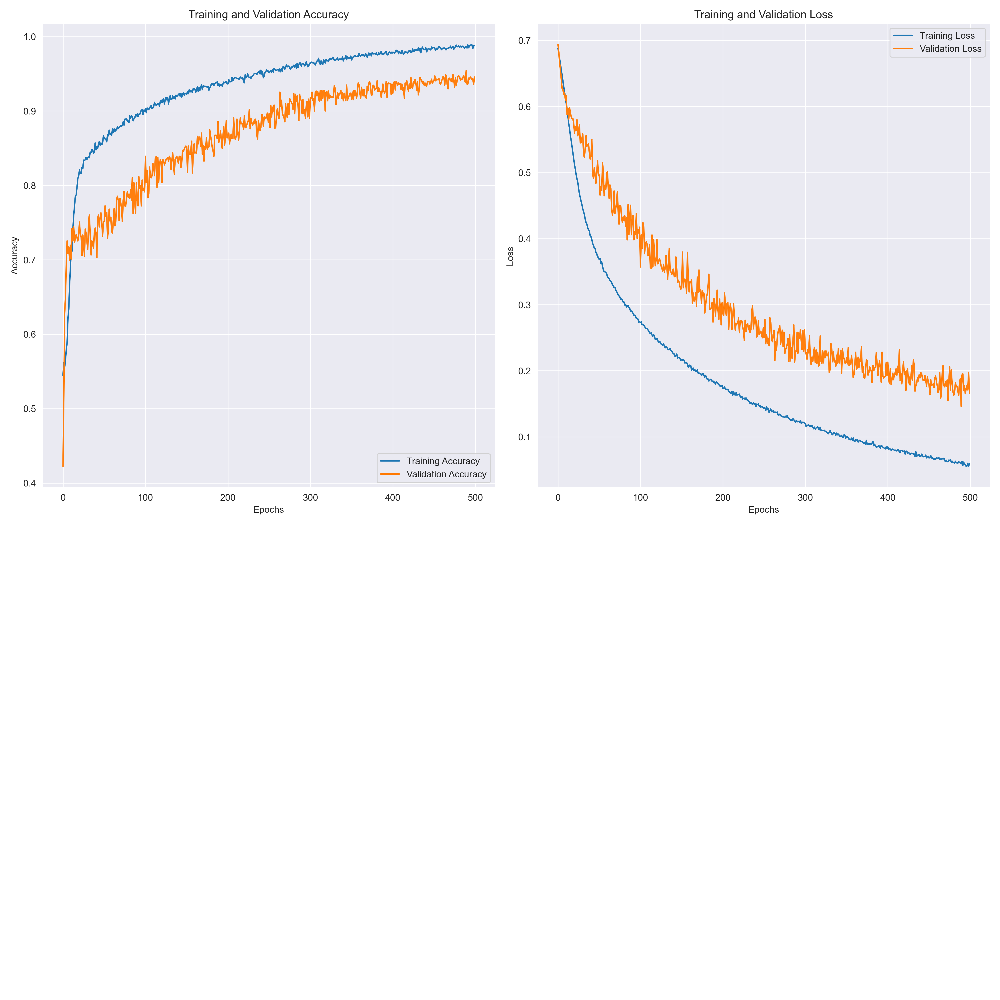

# MRI Brain Tumor Image Classification
## Overview:
This project focuses on classifying brain MRI images as either "tumor" or "normal" using a **Convolutional Neural Network (CNN)**. The model is trained on a Kaggle brain MRI dataset, with architecture adapted from a well-known tutorial by  [Analytics Vidhya Tutorial](https://www.analyticsvidhya.com/blog/2020/10/create-image-classification-model-python-keras/).

CNNs are a specialized type of **Neural Networks (NNs)** designed for image-related tasks, where the data is inherently spatial (i.e., images, videos, and other grid-like data). Unlike regular NNs that process 1D vector inputs, CNNs work directly with 2D or 3D grids (such as images), preserving the spatial relationships between the elements (e.g., pixels in an image). This makes CNNs ideal for image classification tasks, particularly in medical imaging for tumor detection in MRI scans.

## Technical Details:
### Model Architecture:
The CNN model is composed of several key layers designed to learn and classify brain tumors effectively:
- **Convolutional Layers:** These layers apply filters (kernels) to the input images to capture essential features such as edges, textures, and patterns. Each convolutional layer helps the model identify low- and high-level features crucial for tumor detection.
- **Pooling Layers:** After convolution, pooling layers are used to reduce the dimensionality of the image while preserving important features. Max pooling is typically used to zoom in on the most relevant information by selecting the highest values from a specific region.
- **Dropout Layers:** Dropout layers are applied after pooling to reduce overfitting, ensuring the model does not memorize the training data but generalizes well to unseen test data. The dropout layer randomly disables a fraction of the neurons during training to prevent overfitting.
- **Fully Connected (Dense) Layers:** These layers perform high-level feature extraction by combining the important features learned by previous layers and classifying them into two categories: tumor or normal.
- ** Actiation Functions:** After each convolutional and dense layer, an activation function like **ReLU (Rectified Linear Unit)** is applied to introduce non-linearity, enabling the model to learn complex patterns.
- ** Output Layer:** The final layer uses a softmax activation function to output probabilities for the "tumor" or "normal" classes. The model predicts the class with the highest probability.

## Data Preprocessing:
The dataset consists of brain MRI images, each labeled as either tumor or normal. The preprocessing steps include:
- **Resizing:** Images are resized to a consistent dimension (e.g., 224x224 pixels) for efficient processing.
- **Normalization:** Pixel values are scaled between 0 and 1 to ensure smooth training.
- **Augmentation:** Data augmentation techniques such as rotation, flipping, and zooming can be used to artificially increase the size of the training dataset and help the model generalize better.

## Performance Metrics:
The model achieved:
- Training Accuracy: 98.69%
- Training Loss: 0.0670
- Validation Accuracy: 95.14%
- Validation Loss: 0.1490

These results indicate the model's strong ability to accurately classify brain MRI images, demonstrating its potential in real-world applications.

## Model Designed to Improve Diagnostic Efficiency:
  This model was specifically designed to assist radiologists and healthcare professionals in real-time tumor detection. By automating the process of classifying MRI images as normal or tumor, the model helps to:
  - **Enhance diagnostic efficiency:** The model allows healthcare practitioners to quickly analyze large volumes of MRI images without spending extensive time manually reviewing each scan.
  - **Reduce human error:** By providing a reliable and consistent classification of tumor images, the model minimizes the risk of missed diagnoses or errors due to fatigue or oversight.
  - **Support high-throughput clinical settings:** With its ability to process a large number of images rapidly, the model is ideal for busy hospitals or medical centers with high patient volumes.
  - **Improve early detection:** The model can assist in identifying brain tumors at an earlier stage, leading to faster treatment and improved patient outcomes.
  - **Assist in monitoring:** The model can be used for monitoring tumor progression or response to treatment by evaluating changes in tumor characteristics over time.
By streamlining the process of tumor identification, the model reduces the workload on radiologists, allowing them to focus on more complex cases and improving overall diagnostic workflow.
